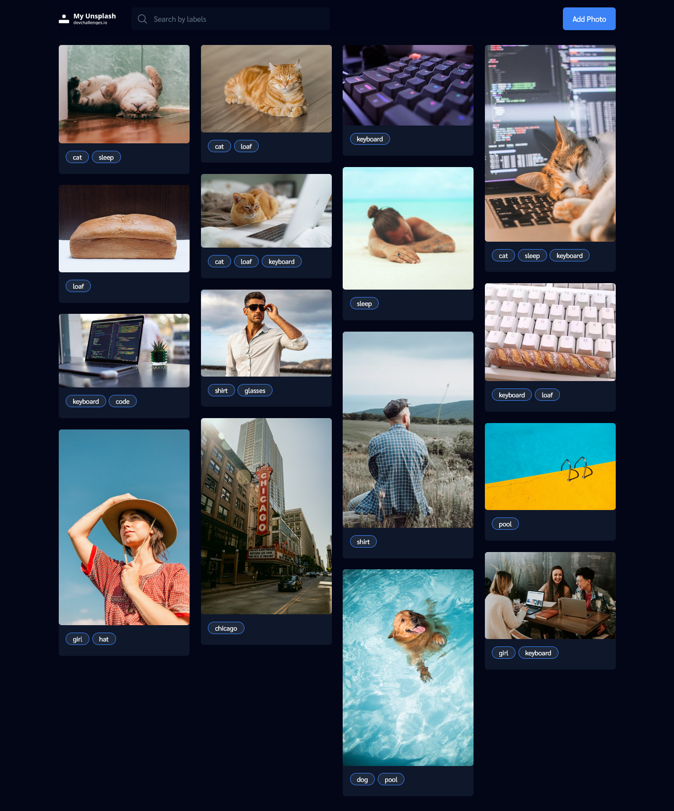

<!-- Please update value in the {}  -->

<h1 align="center">My Unsplash</h1>

<div align="center">
   Solution for a challenge from  <a href="http://devchallenges.io" target="_blank">Devchallenges.io</a>.
</div>

<div align="center">
  <h3>
    <a href="https://dc-my-unsplash.web.app/">
      Demo
    </a>
    <span> | </span>
    <a href="https://devchallenges.io/solutions/VAbyy5wXd80w7Hn6yV1b">
      Solution
    </a>
    <span> | </span>
    <a href="https://devchallenges.io/challenges/rYyhwJAxMfES5jNQ9YsP">
      Challenge
    </a>
  </h3>
</div>

<!-- TABLE OF CONTENTS -->

## Table of Contents

- [Overview](#overview)
  - [Built With](#built-with)
- [Features](#features)
- [How to use](#how-to-use)
- [Contact](#contact)
- [Acknowledgements](#acknowledgements)

<!-- OVERVIEW -->

## Overview



### Built With

<!-- This section should list any major frameworks that you built your project using. Here are a few examples.-->

- [React](https://reactjs.org/)
- [Tailwind](https://tailwindcss.com/)

## Features

This application/site was created as a submission to a [DevChallenges](https://devchallenges.io/challenges) challenge. The [challenge](https://devchallenges.io/challenges/rYyhwJAxMfES5jNQ9YsP) was to build an application to complete the given user stories.

- I can see a list of photos in the masonry layout that I have added
- I can add a new photo to the list - the new photo should be on top of the list
- I can search for photos by label
- When I hover a photo, I can see a label and a delete button
- I can delete images


## How To Use

<!-- Example: -->

To clone and run this application, you'll need [Git](https://git-scm.com) and [Node.js](https://nodejs.org/en/download/) (which comes with [npm](http://npmjs.com)) installed on your computer. From your command line:

```bash
# Clone this repository
$ git clone https://github.com/vietan0/dc-my-unsplash.git

# Run
$ cd client && npm i && npm run dev
```

## Acknowledgements

- [Fireship - using Intersection Observer](https://fireship.io/snippets/intersection-observer-lazy-load-images/)

## Contact

- GitHub [@vietan0](https://github.com/vietan0/)
- Twitter [@vietan00892b](https://twitter.com/vietan00892b)
